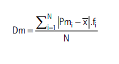

# **Fórmulas utilizadas**

[Média Simples (Mean)](#média-simples) - [Média Ponderada (WeightAverage)](#média-ponderada) - [Mediana (Median)](#mediana) - [Amplitude](#amplitude) - [Ponto Médio (Midpoint)](#ponto-médio) - [Desvio Médio Simples (MeanDeviation)](#desvio-médio-simples) - [Desvio Médio por Frequência (MeanDeviationByFrequency)](#desvio-médio-por-frequência) - [Desvio Padrão (StandardDeviation)](#desvio-padrão) - [Desvio padrão por ponto médio e frequência (StandardDeviationByFrequency)](#desvio-padrão-por-ponto-médio-e-frequência) - [Fatorial (Factorial)](#fatorial) - [Binomial](#binomial) - [Arranjo Simples (Arrangements)](#arranjo-simples) - [Combinação Simples (Combination)](#combinação-simples) - [Probabilidade de ocorrência (OccurrenceProbability)](#probabilidade-de-ocorrência) - [Distribuição Binomial (BinomialDistribution)](#distribuição-binomial) - [Coeficiente de correlação linear (LinearCorrelationCoefficient)](#coeficiente-de-correlação-linear)

### Média Simples

 

#

### Média Ponderada

#

### Mediana

 

#

### Amplitude

 

### Ponto Médio

 

#

### Desvio Médio Simples

 

#

### Desvio Médio por Frequência

  
 
#

### Desvio Padrão

 

#

### Desvio Padrão por ponto médio e frequência

 

#

### Fatorial

 

#

### Binomial

 

#

### Arranjo Simples

 

#

### Combinação Simples

 

#

### Probabilidade de ocorrência

 

#

### Distribuição binomial

 

#

### Coeficiente de correlação linear

 
